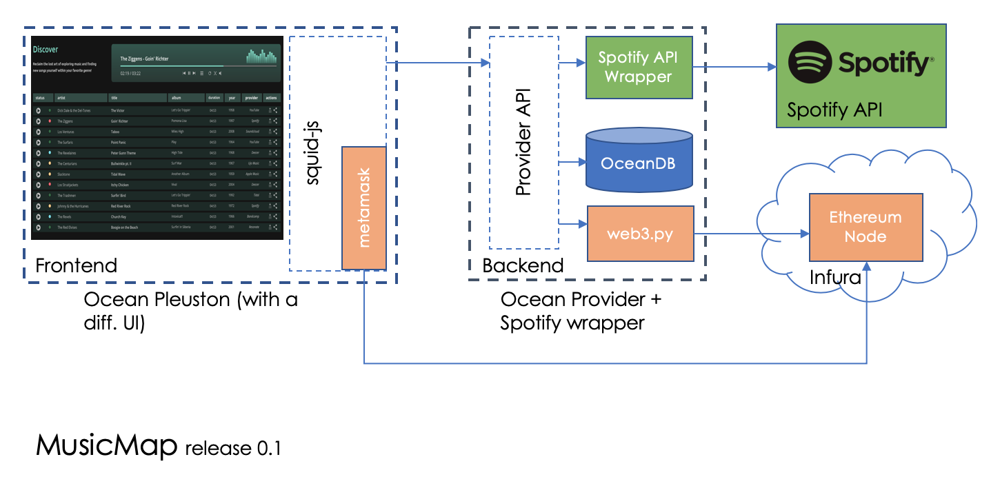

# MusicMap: Release 0.1 - High Level Design

This document describes low-level design for MusicMap release 0.1. MusicMap will be built as a showcase marketplace on top of Ocean Protocol.

## Components

1. **Frontend** - The MusicMap frontend will be a react.js application. This application will interact with the MusicMap provider backend and Ethereum network using **Ocean's squid-js** library. The front will also integrate with MetaMask via squid-js.
1. **Backend API** - The backend API for MusicMap will be built using **Ocean's provider API**. All components needed for MusicMap backend (API, metadata store for cache and web3) are available as part of the provider API. The preferred metadata store (OceanDB storage) for MusicMap will be MongoDB.
1. **Smart Contracts** - For music curation in MusicMap, the TCR contract from **Ocean's keeper-contracts** will be used. The TCR parameter values will be defined separately for MusicMap.

The following diagram shows the MusicMap release 0.1 architecture comprising of Ocean components.

## Ethereum Smart Contracts

1. The Ocean token contract will be replicated to create Proto-MMT (proto MusicMap token) contract.
1. The Ocean registry contract will be replicated to create MusicMap registry contract.

## Things to consider

1. Loading all the listings directly from the smart contract is not optimal. Server side caching should be used. The cache can be managed using cache-aside pattern for synchronization with the TCR smart contract when listing state changes.
1. In the interim, it should be OK to load all the metadata directly from the provider API. The latency to load it from a MusicMap managed metadata store would be almost the same as loading it from the provider directly. This way we can reduce a lot of data synchronization issues.

## Further Optimizations

1. Gas optimizations for calling smart contracts.
1. What should be the frequency to invalidate and update the cache?
1. Who should pay the gas costs, MusicMap or the user?

### Developer References

1. [Spotify API - Authorization](https://developer.spotify.com/documentation/general/guides/authorization-guide/)
1. [Spotify API - Get Track Info](https://developer.spotify.com/documentation/web-api/reference/tracks/get-track/)
1. [MetaMask call smart contract](https://medium.com/metamask/calling-a-smart-contract-with-a-button-d278b1e76705)