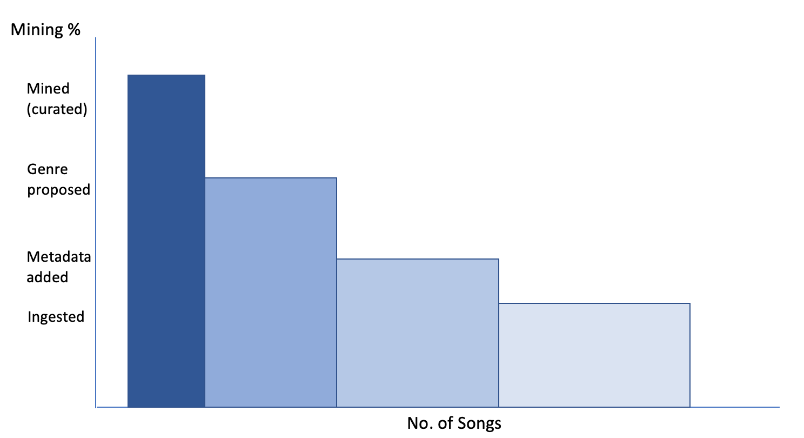

# MusicMap - Song Mining

The current plan and design for MusicMap does not cater to the bootstrapping and gamification of the entire flow for curation of a song.

At the moment, the approach is to add songs in the system as and when they are proposed by the contributors. This approach does not incentivize addition of new music to the platform. The platform may face lack of participation because of lack of music to be curated. To avoid this, we need to prime the platform with music. To prime the platform, we need to incentivize the priming as well.

To solve this, @diminator came up with the following approach and discussed it with @dgossen and @gautamdhameja. The following are notes from our brainstorming session.

## Song Mining

A song in MusicMap can have the following stages in it's lifecycle,

1. Ingested
1. Metadata added
1. Genre proposed
1. Genre finalized (curated)

In the final stage, we can call a song **mined** in the system. For each stage of the song mining, there should be rewards for participants. There should be rewards for:

* Bulk ingestion of songs
* Adding metadata to ingested songs
* Proposing a genre to an ingested song
* Helping curate songs in a genre

### Approach 1

For each step, we need gamification independent of the other steps. This way the participants can **mine** their rewards without waiting and/or depending on others.

> Open question - How do we gamify each of the song mining stages?

### Approach 2

Another approach could be to track the lifecycle individually for each song. This provides and end-to-end view for a songs. In this approach, the rewards will be **mined** by participants only when the song reaches the final stage. But this approach makes the initial participants wait until the song is finalized.

> Can we make both approaches work together?

Maybe we gamify each of the stages separately and but release the rewards using a bonding curve? The earlier you participate in the lifecycle of a song, the more rewards you get.

To be discussed and iterated upon...
