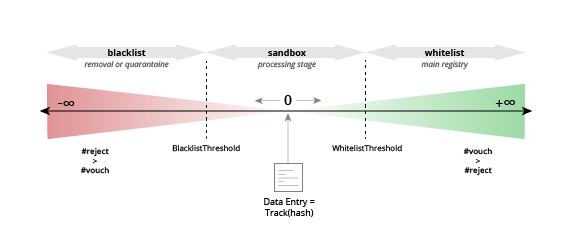
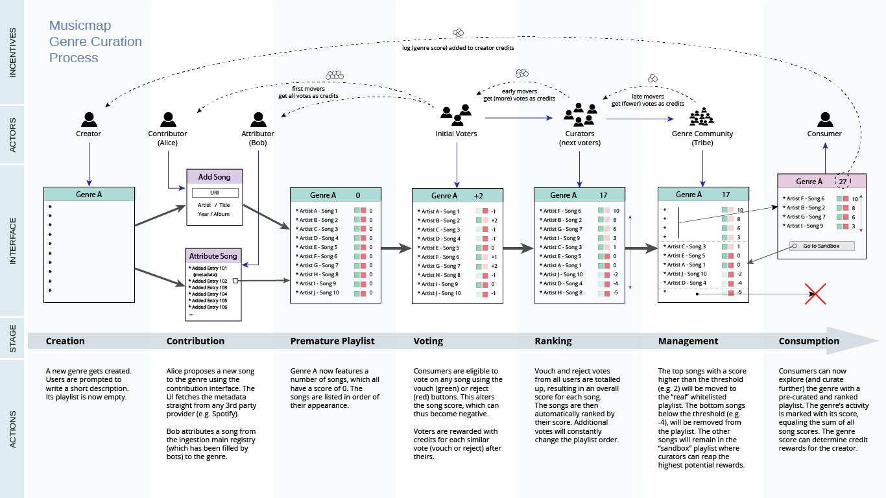

# Game Mechanics Part IIb - Continuous Voting Model

## Vouch or Reject Votes

Instead of working with phase-oriented and politics-inspired challenging and voting mechanisms, we can also take a looser and more reputation-based approach, aligning better with a dynamic audience for which the challenging and voting mechanics might feel slow and cumbersome. In this approach, we propose a system of upvoting and downvoting, but where the registry tracks the entire history of votes (thus preferably on-chain, albeit with a compiled bulk of transactions). 

For each song, a user can vote (but only once) whether or not that song indeed belongs to the genre (vouch, check) or needs to be rejected (reject, cross). Therefore, voting reject equals challenging that song. Of course, a user can also take no action. 

The songs (tracks) of a certain genre will be ranked according to the overall sum of votes by the simple formula:  

Track rating = TR = ⅀(vouch) - ⅀(reject)

When a track has more reject votes than vouches, this will result in a negative track rating. A very low negative rating will lead to the track becoming blacklisted and possible removal. When a track has a lot more vouch than reject votes, it will become whitelisted and added to the main registry. In this case, the track has a high rating, which can still be increased by additional vouch votes in that registry to determine which tracks should belong at the top.  
By removing or quarantaining blacklisted songs, additional votes have become impossible and we have essentially made the track rating scale asymmetrical, i.e. a track can be rated upwards infinitely but not downwards. This will make our business logic more complex and introduce additional rules. However, an asymmetrical rating scale makes more sense as deciding whether or not a track should have a rating of -500 or -5000 is a serious waste of community effort (it is already clear that the track does not belong in the list). Therefore a Blacklist Treshold ensures a focus of curation where it is needed and keep registries tidy.

When a user chooses either to vouch or reject, he or she will receive all the subsequent respective votes from the same direction as credit points. So if Alice chooses to reject, all the rejection votes from other users after hers will count towards her score. But also vice versa: if Bob chooses to vouch, he will receive all subsequent vouch votes. Because of the asymmetry of our rating scale, each user will have two different scores (per genre). The top user scores will be displayed in leaderboards: one for the users with the highest vouch points _(defender score)_ and one for the users with the highest reject points _(challenger score which will normally be much lower on average than the defender score)_. These leaderboards might unlock different permissions.

The total amount of track ratings (including the negative ones) will result in the overall genre rating, which is a direct indicator of the genre’s popularity or activity. Take note that it is thus possible to have a negative genre rating.

Genre rating = GR = ⅀(TRn)

Proposing a track will automatically add the track to the registry (there is no application stage) with a score of 0, and will also mark your vote for that track as vouch.

## Punishment and Control

To prevent users from senseless spamming votes or not curating wisely, the three following balance checks will be implemented:

1. Add a maximum amount of votes per user per time interval (day).
2. When voting reject to a track that eventually gets whitelisted, your user challenger score will be slashed by (TR - WT) where WT is whitelist threshold. Thus: the more popular a track becomes, the more you will be slashed if you voted against it.
If you vote reject to a song that is already whitelisted, you will receive no penalty.
3. When voting vouch to a song that eventually gets blacklisted, your user defender score will be slashed by 5 times the average track rating. This multiplier is derived from the estimation that about 80% of the sandbox registry will be correct.
This also applies to the proposer of a new track (contributor).

## Benefits & Drawbacks 

**Benefits ++++**

* The community has the ability to signal the most important, exemplary songs for that genre, making the playlist more interesting from an educational point of view (like original musicmap). The highest ranking songs should be the one most exemplary to that genre, i.e. the quintessential shortlist.
* There are less complex mechanics involved. There are only two actions per song.
* No more duration of voting and applying: faster filling of list.
* Workload (attention) is equally divided between all songs, users are more incentivized to cast votes for all songs instead of arbitrary ones.
* Your score can go up by doing nothing.
* The system does not rely on a minimum amount of curators for bootstrapping initial challenges and applications. Lists get filled and can be curated at any time without required response.
* Once a song is high in the list (lots of votes) it’s almost impossible to vote it out. This is a good thing, because it locks community-approved entries in place and prevents accidents of removing high-quality songs by unattendance of curators.

**Drawbacks (and solutions) ----**

* Due to the removal of an application stage, there is less control over which songs initially enter the registry (auto acceptance), which might cause visual clutter of bad entries (especially with small lists) and even worse: signal a wrong schelling point.
> This is why a whitelist with threshold should be implemented. A separate sandbox playlist will also appeal to speculators who will hunt in the initial registry for good songs cause that can give them a high score.
* Less gamification (read: addiction) due to no possibility of special action achievements (no challenging or voting awards).
> Yes, but because these mechanics are gone, they also dont need to be incentivized.
* More transactions to be stored?
> Remains to be seen.
* You cannot change your initial choice, which has eternal consequences
> Ability to withdraw your vote could be implemented, but we don't want to overcomplicate the logic. This will also make users vote more carefully.

## Governance Parameters

These are critical parameters that ought to be able to be changed by the top leaderboard or other curators. The finetuning of these parameters is essential to the survival of the ecosystem, but only known after many realtime simulations.

**PunishmentMultiplier**  
The multiply factor that is used on the average song score, which then serves as a punishment for the user.  
**BlacklistThreshold**  
The negative value of total votes from which a song permanently becomes removed from the registry (e.g. -100)  
**WhitelistThreshold**  
The positive value of total votes from which a song becomes displayed in the main registry (.e.g. 10)  
**AchievementThreshold**  
The minimum credit score a user must have before being eligible to obtain achievements. _(not for first release)_  
**CartaThreshold**  
The minimum genre score a genre must have before it is displayed on the carta. _(not for first release)_  

Eventually we want to have an ecosystem in place where the initial, immature registries (i.e. the first 50 or 100 entries) are more strictly curated for aforementioned reasons.
This can be done by implementing different parameters for this phase:
* Have at least 40% different artists (thus 20 or 40).
* WhitelistThreshold increased to +20
* PunishmentMultiplier increased
* RemovalThreshold decreased to -50
* Max proposals per user?

## Attack Vectors & Problems

The following chapter tries to find possible means of cheating or attacking the system and how to prevent this.

**Spam everything accept**  
You are more likely to win than to gain as the lists should be already 70-90% correct (estimate). This is also a quick way to bump artificially the overall score of a genre.
>    → Punishment for clicking accept when it gets rejected should be accordingly high. That is why there is a multiplier and average track rating.

**Troll Propose Attack**  
Spam propose as many songs as possible from a totally different genre.
 >   → Implement punishment for the proposer when a song gets removed.

**Diverging from Schelling Point**  
The initial bootstrapping phase is very important to set the right Schelling Point direction.
When the first 50-100 songs define a different schelling point than the actual genre definition, it is very hard to rectify, as the initial playlist - accepted by the community - will have become the source of truth.
>    → Define different, more strict rules for the first 50-100 songs  
    → Allow governance for the genre title and registry (to be changed, alterered or even subcategorized)  
    → WIKI should also mitigate this risk

**Personal User Troll Attacks**  
Certain users become targeted to decrease their user points and dethrone them from the leaderboard
>    → implement maximum anonimity, only show user names at leaderboard. Make sure user ID cannot be fetched from the back end

**Spam everything reject (with different accounts)**  
This attack might be attempted to hurt the overall genre score. When performed on songs that are already whitelisted, there's no risk of punishment.
>    → make it so that user scores are not affected by the opposite votes (i.e. when i vote accept, the number of reject votes afterwards do not matter)  
    → track user IP? Make ID’s unique? Unique emailadresses?
    → because there is a limited amount of votes per day and the songs are whitelisted, you will waste your votes without any score increase. 

**Coordinated group attack**  
Influence a large group of people by all voting in the same direction to win credit points or to bump or attack a specific song.
>    → Do not implement user fora or links to reddit channels to prevent coordinated attacks  
    → this attack is already mitigated because only the first ones will win a lot. The last in line never has any benefit for voting in the same direction that it was going.  
    → Implement time lock if a song receives more than X votes in Y time (can be implemented later)

**Skewing of Genres**  
>    → This is for later, but can be prevented by reward for bottom 20% of genres and penalty for top 20% of genres. This can be a fixed multiplier reward (x2, x1,5,...).

**Bootstrapping / Chicken or Egg problem**  
When the lists remain relatively empty, there will be no incentive to further fill them. Vicious cycle. An early mover advantage must be put into place.
>    → Ties in with different rules for initial registry. Reward first 50-100 songs harder.

**Bump to the top**  
Once a song has established lots of positive votes, it will become almost “untouchable”. Bumping a song fast to high place with different accounts can net the user lots of points and can also put incorrect songs for a long time in the list.
>    → Prevent many bumps within a limited timespan. (can be implemented later)

**Misinterpretation / Absence of Schelling Point**  
Consumers can assume the reject and vouch buttons are more like “likes” and “dislikes” where they just vote on music they like, and reject whatever they don’t like instead of objectively assessing whether or not it belongs to that genre.
>    → Make forking of genres easy and almost effortless so that toxic genres can become ignored and new schelling points established  
    → Add warning pop up with explanation before confirming all votes  
    → UI must use clear buttons with red cross for reject and green mark for vouch and certainly not thumbs up or down (like YouTube Music)

**King of Nothing**  
With a credit system per genre and permissions only granted for the top users within a genre, the community is being incentivized to make lots of genres and keep genre community small. Thus increasing their individual chances to unlock achievements. Making very small niche genres with a small community, quickly enables to be at the top, flooding the ecosystem with useless registries instead of establishing the perfect genre equilibrium.
>    → Set a minimum threshold in credit points before achievements get unlocked (e.g. 1000 points). This will make it almost impossible with niche lists to reap the rewards. Users are incentivized to make sure the registries will hold plenty of songs to gain lots of points but also with a good schelling point if they want to take full advantage of early mover advantage.
    Also registries that don’t have a total score of at least X, will not be pushed to the map.

#### Continue reading the game mechanics [here](https://github.com/oceanprotocol/musicmap/blob/master/specs/mechanics_part_iii.md).
