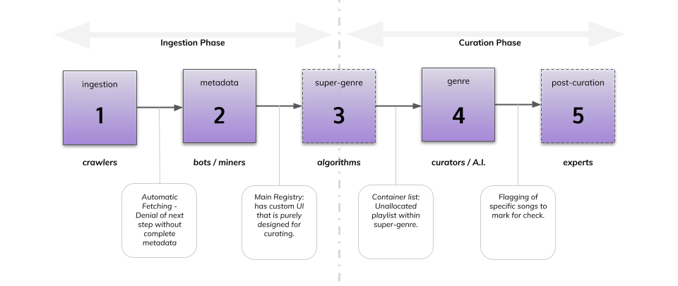

# Game Mechanics Part I - General & Ingestion

## Data Pipeline

Every type of data needs to go through a multi-phase process before the data or service is able to be discovered or consumed. Such phases are ingestion, normalizing, storing, curating and so on. This is referred to as a data pipeline. Instead of watching the entire pipeline as an end-to-end process for each data entry, we suggest to split the pipeline for musicmap into two big phases: an ingestion phase and a curation phase. This has several benefits: the monotonous and non-scientific work becomes separated from the more difficult work that requires a greater deal of intelligence. This will allow both pipelines to operate at different speeds, without the curation phase becoming a bottleneck for the ingestion phase. The ingestion phase can be automated by bots and programs, allowing for even faster ingestion. With all the data and its corresponding metadata already in place, the workload and initial barrier for the human curators to start curating becomes much smaller.

## Ingestion Phase

During the ingestion phase, either human or bot contributors can enter new songs to the main registry. Human contributors will interact with a contributor UI with captcha identification that will allow to add bulk (add several songs in one action) and that tries to automatically fetch the metadata from the 3rd party provider.  Bot contributors on the other hand can directly interact with the API. To accelerate the whole process, we will not regard this as a TCR with challenging and staking mechanisms. Instead, the data will simply automatically be vetted for consistency (is this an audio link?) uniqueness (is this song not already in the registry?), and - if possible - inappropriate or illegal behaviour (which should become not really a problem when using only YouTube Music instead of YouTube). Once vetted, the data becomes automatically added to the main registry or “unallocated” group of songs. The metadata gets stored in a centralized metadata storage, where the unique hash of each song (of combined metadata) gets written on-chain. 

The token contract will mint tokens as reward for the contributors. Human contributors will be rewarded more tokens per contribution than bots. Therefore, instead of buying in tokens, a frictionless utility token is proposed that rewards work. A user’s token funds are thus directly tied to their contribution to the network, ruling out any form of financial speculation or attack vector. 

This first Ingestion or Contribution phase should also be regarded as a roadmap period after final release: a first stage that serves as an introduction to musicmap. This stage can be marketed as a first-phase full scale assault (“bot wars”) without the need for focus on curation. This allows the greater public to become familiar with musicmap and to give the community the time to think about proper curation. In addition: the bigger the unallocated registry grows, the more the community will be motivated to start curating it. It is more incentivizing to categorize an enormous list into various labels than filling numerous empty lists of different labels.

Alternatively, because the ingestion phase is separate from the curation phase, it might not be that harmful for the bootstrapping of the network to work with a financial token and potentially a bonding curve. Such design might prove useful in bridging the non-crypto with the crypto community.

## Curation Phase

Separating the ingestion from the curation pipeline has the additional benefit of specialized users and allowing anyone to help out: people who want to contribute to musicmap but do not possess any specific genre knowledge can do so by ingesting the main list. Vice versa: people who know a lot about music and genres but do not want to bother with tokens or ingestion, can go straight to the curation phase. Of course, contributors can also be curators and the other way around.

During the curation phase, agents can interact with the main registry UI to place each song in the correct genre registry (after the condition has been met that this genre is created first). These agents are most likely humans, but they can also be algorithms as any mistake made by the A.I. can be corrected by human agents afterwards. 

Because mass adoption by a largely non-crypto community is absolutely paramount to the success of musicmap, the friction of a crypto wallet and the barrier of tying financial liquidity to any token cannot be underestimated enough. We believe that this problem is vastly ignored by many crypto projects, and they do not even rely on a community that is far, far away from the crypto space as musicmap does. Therefore the curation phase will not work with tokens in the traditional sense, but user credits that can be stored off chain or on-chain as a non-ERC20 utility token without any form of exchange. There are several benefits of working with credits instead of buy-in tokens with a traditional TCR: 1. The removal of a wallet and any form of financial risk or abuse. 2. The possibility to create genre-specific credits, without having to deploy a large amount of costly tokens (estimated between 200 and 500 different credits). 3. The ability to burn and mint by will with little impact on the value of the credit/token and without the restraint of having to implement a zero sum balance. 4. Whales cannot force their way in by buying lots of tokens. 5. The parameter values for each type of credit reward and penalty can be independently finetuned.

Curators will be rewarded credits according to the genre in which they are curating. Any statistical user data will also be tracked in the user database. The genre lists will thus work as a TCR, albeit with credits instead of tokens [(Credit Curated Registry or CCR)](https://github.com/oceanprotocol/musicmap/blob/master/specs/mechanics_part_iia.md). 
A different approach is described in the [Continuous Voting Model](https://github.com/oceanprotocol/musicmap/blob/master/specs/mechanics_part-iib.md), which is more likely to be mass adopted.
