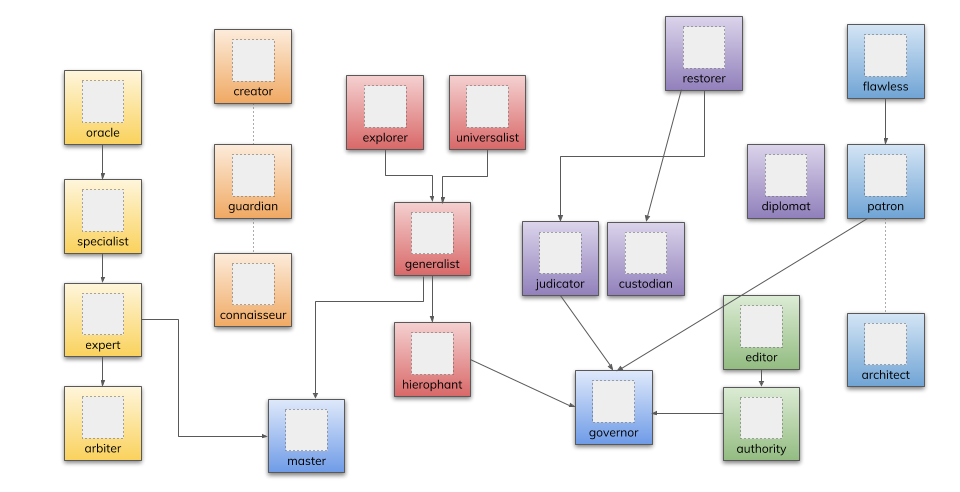
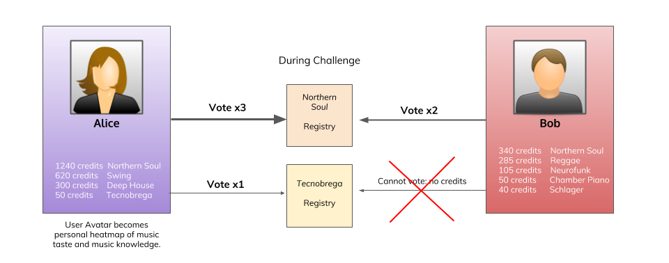

# Game Mechanics Part IIa : CCR & The Achievement Game

## The Achievement Game

The only way to incentivize users to curate musicmap without any financial reward, is to create a meta game around curation phase credits that is both fun and addictive. Our design is not to reinvent the wheel but to implement various user achievements, based on type of credits and/or user data, like a real game. These achievements (almost) all consist of different tiers (bronze, silver, gold, platinum) and can be dependant on each other (achievement tree where user needs to unlock achievements). The lowest tiers will be easily obtainable whereas the highest tiers will require tremendous amounts of work.

There are a few inherent incentives tied to such a classic achievement system:
peer recognition, social status (through avatars and leaderboards)
self-improvement (learn more about a specific genre)
broaden knowledge (learn about other genres, get outside comfort zone)
gaming addiction of gathering a collection (collect them all)

But this is most likely not enough. Therefore achievement-specific user rewards need to be put in place. Possible rewards can include:

Create custom playlists that get pushed to the top or placed somewhere visible
Allow user to modify artwork, theme or other visual aspect of genre UI
Enable user to create a new genre
Allow user greater permissions, e.g. change governance parameters
If allowed by artist, grant user downloads

Possible achievements can be:

* **X Expert:**                 Most points within one (super)genre (+second and third place)
* **Generalist:**             Curate within 50%/75%/all different genres
* **X Master:**                Curate all genres within a specific supergenre (at least 10/100/1000 songs)
* **Explorer:**                Curate within at least 5/10/20 different genres
* **Restorer:**                Challenge successfully at least 50/100/200 songs
* **Diplomat:**               Vote at least 100/500/1000 times
* **Universalist:**           Curate (at least one genre) 50%/75%/100% of all supergenres
* **Flawless:**                 Propose at least 100 songs without a successful challenge
* **X Specialist:**            Propose minimum 100/500/1000 songs, challenge successfully minimum 5/10/15 songs, cast minimum 50/150/250 votes, all within the same genre
* **X Creator:**               Creator of that genre (after a successful incubation period and a minimum filling of 100 songs)
* **X Guardian:**            Early filler of that genre (responsible for filling 10/25/50% of first 1000 songs)
* **X Connaisseur:**       Propose successfully at least 100/200/500 songs after a genre already has 50.000 songs
* **Custodian:**              Successfully delete 1/2/5 specific genres
* **X Arbiter:**               User becomes moderator (and vice and third) for that genre portal (choose artwork?) after Expert and Specialist and Oracle check
* **X Oracle:**                 Propose from at least 50/100/200 different artists within a single genre
* **Editor:**                     Contribute to WIKI content
* **Patron:**                    Reach a total of 500/1000/2000 proposed songs
* **Judicator:**                Challenge and successfully re-propose (in a different genre) at least 50/100/200 songs
* **X Authority:**           Make at least 10/20/50 edits or contributions to that genre’s WIKI content
* **Architect:**               Successfully determine a genre as a subgenre of another one (important for visual clutter maintenance)
* **Hierophant:**           Propose minimum 1/5/10 songs in all different genres

These achievements can potentially be stored in a transparent and immutable way as a NFT (optional, probably not recommended). Gaining an actual, more physical (though still digital) token tied to your achievement, further boosts the incentive game. It also creates the possibility to experiment with expiry dates. This means that certain (achievement) tokens might decay over time, to incentivize people to use them if deemed useful. NFT’s can also be traded although that might defeat their purpose.

## Credit Curation Registry

The Credit curation registry will function similarly to a TCR, albeit with different rules. From the main registry users can propose certain songs in specific genres. They will receive genre credits for doing so. For example: Alice proposes 10 new Soul Jazz songs and receives 10 x 100 credits per song = 1000 Soul Jazz Credits. Alice also has 14k Power Metal and 800 Deep House Credits, so that Alice personal music taste or heatmap becomes immediately displayed. Yes, Alice has a surprising music taste. When a song is proposed, it will first enter an application stage, and it will not appear for the consumer in the front end, only for the curator. 

Within the genre UI, other users have the ability to challenge multiple songs or vote for songs currently being challenged. In order to challenge, one has to stake a certain amount of credits that is fixed. This means although proposing songs can be done without any fiat (credits are minted), challenging songs requires you to have a minimum amount of credits as collateral which - on top of that - need to belong to the same genre as the challenged entry. Thus only users who have already contributed to that genre and shown a certain knowledge or interest in that genre, can actually curate it. This further incentivizes people to propose new songs to existing registries to build up their own collateral if they want to challenge songs. This also mitigates possible trolling and negative behaviour (users who target specific users or genres for constant challenging). This would never be possible with a generic one-size-fits-all token, opening up all kinds of unwanted behaviour and skewing the balance.

There are 7 parameterizable actions:
* Reward for proposing a song that gets accepted:                 +50C
* Reward for successfully challenging a song:                    +90C
* Reward for casting a majority vote:                        +10C
* Penalty for proposing a track that gets rejected:                    -90C
* Penalty for casting a minority vote:                        -0C
* Penalty for having a challenge rejected:                        -0C
* Penalty for withdrawing a proposed song:                    -20C

These actions can be decoupled if a difference between during and after application stage is desirable, counting 12 actions.

When a challenge is issued, a voting process starts. The mechanics must incentivize as many users as possible to participate to the voting, therefore effort must be minimum (not like the partial-lock-commit-reveal-JSON-submit process on AdChain) and voter rewards must not be dependant on number of voters. There must be a minimum amount of voters (e.g. 5) or the challenge will not stop. Once either the timeout has ended or 5 voters have been reached, the challenge will come to an end.

With credits that can cost-free be minted, we can simply reward each voter of the majority bloc the same amount and allow voting simply by clicking a button in the front end. Users who have earned most credits within a genre will have bigger weight than other users. For example: Alice has 28 credits, Bob 1540 credits and Cecilia 12300 credits, all within Reggae. Bob vote may count double whereas Cecilia’s vote may count triple when voting on a Reggae challenge.

If the total amount of credits for a certain genre g equals Cg and the voting weight is a natural number v = 0,1,2,3… then:

V ~ log(Cg) - 1

It may or may not be desirable to implement quadratic voting, where voting is no longer free but voters have to stake a (small) amount of genre credits. Quadratic voting means that voters can cast more than one vote per challenge, but this will cost exponentially more (to a maximum of 4 votes and deposit^4 stake). Thus also only users with a minimum amount of certain genre credits can participate in the voting of said genre. Users can be made aware by challenges in their genres by enabling customizable notifications.

**Balance**

This section deals with the overall balance of the playlists, which is important for the success of the network and the UX of the consumer. This mainly consists of two parts: bootstrapping and anti-skewing.

Bootstrapping the registries must specifically be incentivized to prevent a classic chicken-or-egg scenario where lists don’t get filled because they are empty and so they remain empty. Such a risk is already partially reduced by the split of the data pipeline (reduction of the workload for the curators). But this is not enough. An early mover advantage must be put in place to make empty genre lists grow as fast as possible to a mature level where they are useful for a consumer. Therefore the number of credits rewarded (for proposing, challenging and voting) will be dependant on the size of the list with a multiplier that will gradually go down or will follow the path of a descending exponential curve.

Anti-skewing mechanics deal with the problem of popular vs non-popular registries: certain genres will probably be very well curated where others might become a mess or even completely ignored. This can be overcome with bounties or penalties. After a certain maturing time (e.g. X amount of blocks), the size of all genre registries can be measured and compared. For those registries that fall in the lower quarter (sizeregistry < 25%), additional credits can be rewarded. Perhaps even coupled with credit penalties for the top quarter (sizeregistry > 75%). This event can re-occur on a regular basis.

## Attack Vectors

**Absence of Schelling Point**

The biggest hurdle with musicmap is defining the Schelling Point for each genre. This can be a subjective matter in cases and the truth can be hard to find. This means low quality information available at low cost where a TCR works ideally with high quality information at low cost. Thus the key here is to turn the information into high quality to establish consensus Schelling points. Therefore the wiki entry for each genre is very important that helps guide the community. 

Furthermore the initial registry (i.e. the first 50 songs for example) will be very crucial for the further development of the list and to establish the correct Schelling point. Therefore it is highly recommended to put unique game mechanics in place for the pioneer entries, with more strict rules but also higher rewards. The initial registry also has the problem of a low amount of curators. 

**Trolling & Genre Hate**

Users will be banned (from a certain genre) if they have more than X rejections within the same genre. The application stage will also prevent incorrect spam attacks to flood genres with wrong entries.

**Spam Attacks**

Needs to be further addressed.

Adding and withdrawing songs immediately?
How is the voting obscured?
Overloading of songs in one genre?

## Genre Portal UI mock-up

The following sketch shows the main genre UI, with playlist, WIKI section and genre metadata. For each song, the curation status is displayed, allowing the user to see whether a song is being challenged or pending and so forth.

Continue reading the Game Mechanics [here](https://github.com/oceanprotocol/musicmap/blob/master/specs/mechanics_part_iii.md).
