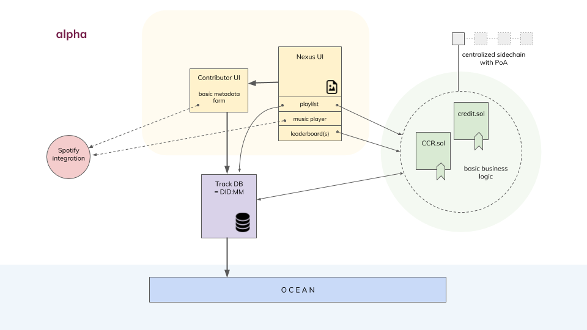
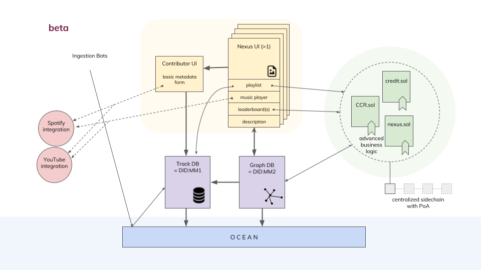
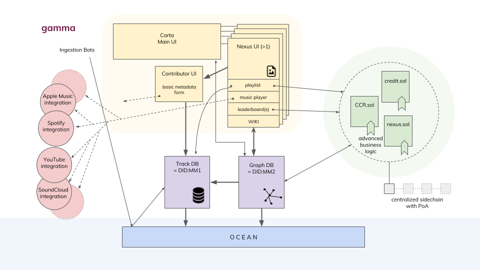

# Musicmap Roadmap / Releases Overview

## Alpha Release

<b>End to End scenario for one genre (Nexus) to test basic functionality and incentive game.</b>

Capabilities:

* Simple Interface for submitting a song (contributor UI)
* Putting song ontology in place
* Metadata Database that holds all URI’s and metadata (centralized)
* Generic music player 
* Integration with first provider (Spotify API)
* Basic Business Logic: credit balance contract and registry governance contract
* Simple User Authentication with … ?
* Generic Nexus Interface with playlist and leaderboard
* Connecting Metadata DB as a DID to the Ocean Network
* Reward Function for contribution and curation

  

## Beta Release

<b>End to End scenario for combination of genres to build the whole framework.</b>

* Simple Search function (open form) per genre and for all
* Enable Ingestion phase with bots to interact with API
* Basic Graph DB that holds relationships (for multiple genres)
* Portal Interface that holds links to all Nexi
* Genre Contributor UI with Description or Wiki requirement
* Wiki/Description segment for Nexus Interface
* Advanced Business Logic: CRUD operations on Nexi, framework incentives
* Integration with second (third) provider (YouTube Music / SoundCloud)
* Simple Graph DB with nodes for Nexi holding all songs (no edges)
* Connecting Graph DB as a DID to the Ocean Network
* Obective Reward Function for Ingestion Phase

  

## Intermediary 

<b>Stepping stone to gamma release. Can be either implemented in Beta or Gamma.</b>

* Basic Carta interface (dynamic map d3.js or canvas) connected to Graph DB
* Secure User Authentication
* Allow multilabel songs.
* Bounties and Penalties for anti-skewing
* Personal User Actions (Saving, Sharing, Playlist Queuing)

## Gamma Release

<b>Implementing dynamic front end (Carta) for the framework and super-genres.</b>

* Super-genre & music groups labels ingestion (non-curation)
* Advanced Carta with relationships (links) and super-genres
* Advanced Graph DB with edges (relationships) and higher level nodes (super-genres)
* Front End Documentation (guidelines, tutorials, contact, privacy, about, disclaimer)
* Personal User Heatmaps and User Data
* Advanced guided search with filters, cross-genre
* WIKI curation mechanism (IP logging, tracking history,...)
* Additional Provider Integration (Apple Music, Deezer, Tidal, Resonate, Ujo…)

  
